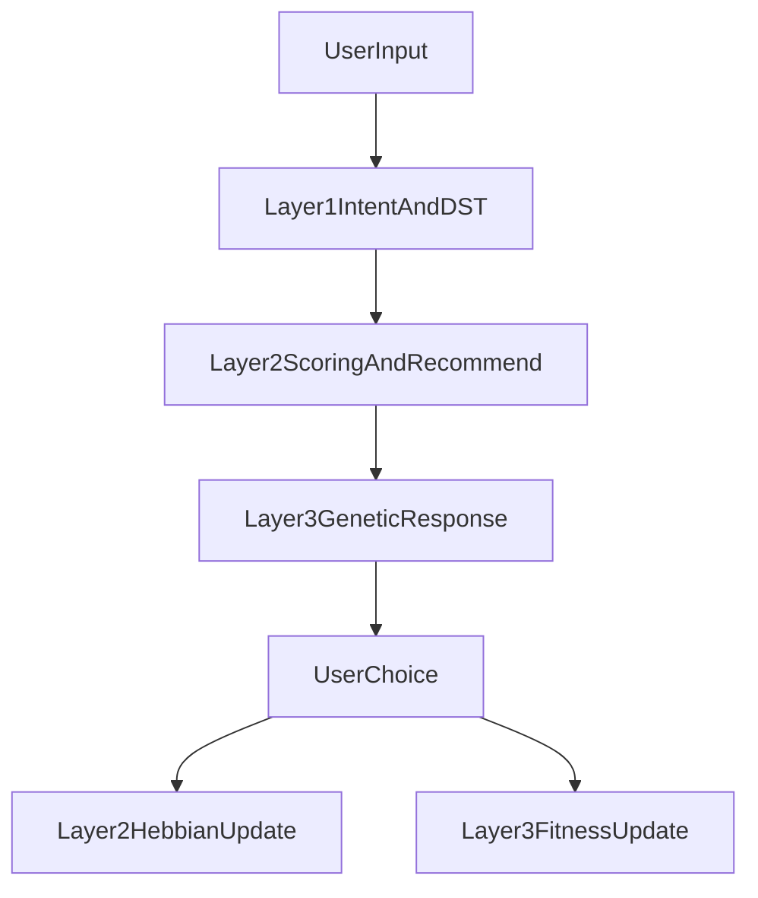

# food-moo-duu
Là bò, sáng phải rống
Là người, sống phải ráng

He thong goi y mon an offline bang Python theo kien truc 3 layer:

- Layer 1: Intent + Dialog State Tracking
- Layer 2: Adaptive Recommendation + Hebbian update
- Layer 3: Genetic Response + Fitness update

## Project Tree

```text
food-moo-duu/
├── main.py
├── Makefile
├── Dockerfile
├── requirements.txt
├── README.md
├── architechture.txt
├── scripts/
│   └── generate_layer1_datasets.py
├── tests/
│   ├── test_layer2.py
│   ├── test_layer2_integration.py
│   └── test_feedback_logging.py
├── src/
│   ├── core/
│   │   ├── constants.py
│   │   └── pipeline.py
│   ├── layer1_intent_context/
│   │   ├── intent_tracker.py
│   │   ├── dialog_state.py
│   │   └── run_layer1.py
│   ├── layer2_adaptive_recommendation/
│   │   ├── recommendation_engine.py
│   │   ├── online_learning.py
│   │   ├── run_layer2.py
│   │   ├── migrate_to_canonical.py
│   │   ├── check_schema_drift.py
│   │   └── reset_runtime.py
│   └── layer3_genetic_response/
│       ├── genetic_generator.py
│       ├── fitness_manager.py
│       └── run_layer3.py
├── data/
│   ├── common_config.json
│   ├── layer1/
│   │   ├── tags.json
│   │   ├── conflict_pairs.json
│   │   ├── datasets.json
│   │   ├── dataset_v001/ ... dataset_v005/
│   │   ├── session_state.json
│   │   └── tag_exports.jsonl
│   ├── layer2/
│   │   ├── datasets.json
│   │   ├── layer2_config.json
│   │   ├── dishes_100.json
│   │   ├── dataset_v001/
│   │   │   ├── food_weight_matrix.json
│   │   │   └── dataset_manifest.json
│   │   └── runtime/
│   │       ├── dataset_v001_dishes_runtime.json
│   │       └── feedback_reports.jsonl
│   └── layer3/
│       ├── datasets.json
│       ├── gene_pool.json
│       ├── fitness_history.json
│       └── dataset_v001/
│           ├── gene_pool.json
│           └── fitness_history.json
└── docker/
    ├── layer1/docker-compose.yml
    ├── layer2/docker-compose.yml
    └── layer3/docker-compose.yml
```

## Data Convention

- Moi layer co `datasets.json` de khai bao `active_dataset`.
- Data train/input nam trong thu muc epoch `dataset_v00x`.
- File runtime (state, feedback log) tach rieng khoi file train.
- Layer1 hien train/predict tu nhieu dataset (`--all-datasets`) khi can.

## Runtime Flow



Ghi chu:
- Full app flow chay qua `main.py` -> `src/core/pipeline.py`.
- Layer3 da co adapter schema, ho tro data canonical theo mood va van update fitness runtime.

## Run Commands (Naming moi)

### Setup

```bash
make setup
```

### Full app

```bash
make app-run
make app-demo
make app-docker
```

### Layer 1

```bash
make layer1-train
make layer1-run
make layer1-chat
make layer1-docker
```

### Layer 2

```bash
make layer2-run
make layer2-docker
make layer2-migrate
make layer2-check
make layer2-test
make layer2-reset-runtime
```

### Layer 3

```bash
make layer3-run
make layer3-docker
```

## Layer1 chat-only flow

- `run_layer1.py` chi xu ly Layer1 (predict + DST + export tag).
- Khong goi Layer2/Layer3 trong mode nay.
- Co the dung `--no-state` de test cau don (raw intent) va `--reset-state` de reset session.

## Layer1 reinforcement data flow (doc lap)

Muc tieu:
- Thu thap du lieu chon mon tu chatbot de huan luyen tang cuong Layer1.
- Khong train ngay trong flow chatbot 3 layer.

### 1) Logging runtime (tu chatbot that)

Khi user chon mon trong `main.py`, he thong append 1 event vao:
- `data/layer1/rl_feedback/selected_dish_events.jsonl`

Schema chinh moi event:
- `timestamp`, `session_id`, `turn_index`
- `user_text`
- `raw_tags`, `context_tags`
- `chosen_dish_id`, `chosen_dish_name`, `reward_signal`
- `recommended_candidates`, `export_mode`, `use_state`, `source`

### 2) Batch simulator (gia lap doc lap)

Sinh du lieu RL feedback mo phong:

```bash
make layer1-rl-generate
```

Output:
- `data/layer1/rl_feedback/selected_dish_events_simulated.jsonl`

### 3) Offline reinforcement training flow (doc lap)

Xu ly feedback thanh tap train tang cuong cho Layer1:

```bash
make layer1-rl-train
```

Artifacts:
- `data/layer1/rl_training/reinforcement_rows.json`
- `data/layer1/rl_training/intent_train_data_rl.json`
- `data/layer1/rl_training/stats.json`

Kiem tra nhanh so luong events:

```bash
make layer1-rl-check
```
