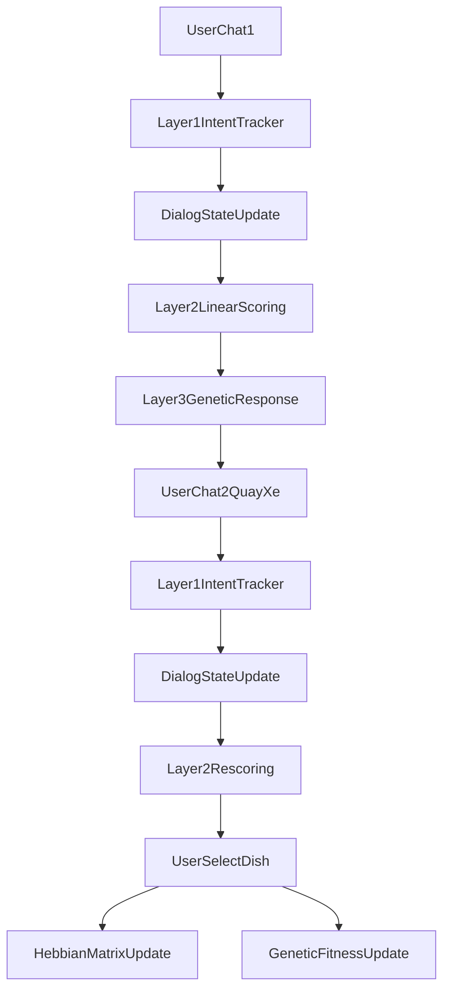

# food-moo-duu

He thong goi y mon an thong minh chay offline bang Python, thiet ke theo kien truc 3 lop:

- Layer 1: Intent & Context Tracking (TF-IDF + ML truyen thong + Dialog State Tracking)
- Layer 2: Adaptive Recommendation Engine (Linear Weight Scoring + Hebbian Online Learning)
- Layer 3: Genetic Response Generator (Template + Genetic Algorithm + Epsilon-Greedy + Roulette)

## Project Tree

```text
food-moo-duu/
├── data/
│   ├── layer1/
│   │   ├── conflict_pairs.json
│   │   ├── intent_samples.csv
│   │   ├── session_state.json         # tu tao khi chay
│   │   └── tags.json
│   ├── layer2/
│   │   └── dishes_100.json
│   └── layer3/
│       ├── fitness_history.json
│       └── gene_pool.json
├── docker/
│   ├── layer1/docker-compose.yml
│   ├── layer2/docker-compose.yml
│   └── layer3/docker-compose.yml
├── src/
│   ├── core/
│   │   ├── constants.py
│   │   └── pipeline.py
│   ├── layer1_intent_context/
│   │   ├── dialog_state.py
│   │   ├── intent_tracker.py
│   │   └── run_layer1.py
│   ├── layer2_adaptive_recommendation/
│   │   ├── online_learning.py
│   │   ├── recommendation_engine.py
│   │   └── run_layer2.py
│   └── layer3_genetic_response/
│       ├── fitness_manager.py
│       ├── genetic_generator.py
│       └── run_layer3.py
├── Dockerfile
├── Makefile
├── main.py
└── requirements.txt
```

## Kien truc va luong xu ly



### Layer 1 - Intent & Context Tracking
- Nhan chat tu user.
- Dung `TfidfVectorizer + OneVsRest(LogisticRegression)` de du doan 30 tags.
- `update_context()` ap dung 3 quy luat:
  - Decay: hao mon diem theo turn.
  - Accumulation: cong don theo confidence moi.
  - Conflict Resolution: giam diem tag yeu trong cap doi nghich.
- Luu trang thai DST vao `data/layer1/session_state.json`.

### Layer 2 - Adaptive Recommendation Engine
- Tinh diem cho 100 mon an theo cong thuc:
  - `score(dish) = sum(activation[tag] * weight[dish][tag])`
- Khi user chon mon:
  - Tang trong so lien ket tag-kich-hoat (Hebbian positive).
  - Giam nhe trong so voi tag yeu de tranh drift (forgetting).
- Luu cap nhat vao `data/layer2/dishes_100.json`.

### Layer 3 - Genetic Response Generator
- Sinh cau theo chromosome `(opening, action, closing)`.
- Chien luoc sinh:
  - Epsilon-Greedy de can bang explore/exploit.
  - Roulette Wheel Selection theo fitness.
  - Mutation them slang theo xac suat.
- Implicit feedback:
  - User chon mon -> tang fitness.
  - User khong chon/thoat -> giam fitness.
- Luu lich su vao `data/layer3/fitness_history.json`.

## Chay local

```bash
python -m pip install -r requirements.txt
python main.py
```

Kich ban demo trong `main.py`:
1. User chat 1 -> goi y top mon.
2. User chat 2 (quay xe) -> cap nhat context -> goi y moi.
3. User nhap ID mon chon -> cap nhat Hebbian + Fitness.

## Lenh nhanh voi Makefile

```bash
make setup
make run
make train-layer1
make layer1
make layer2
make layer3
```

## Docker Compose theo tung layer

```bash
docker compose -f docker/layer1/docker-compose.yml up --build
docker compose -f docker/layer2/docker-compose.yml up --build
docker compose -f docker/layer3/docker-compose.yml up --build
```
